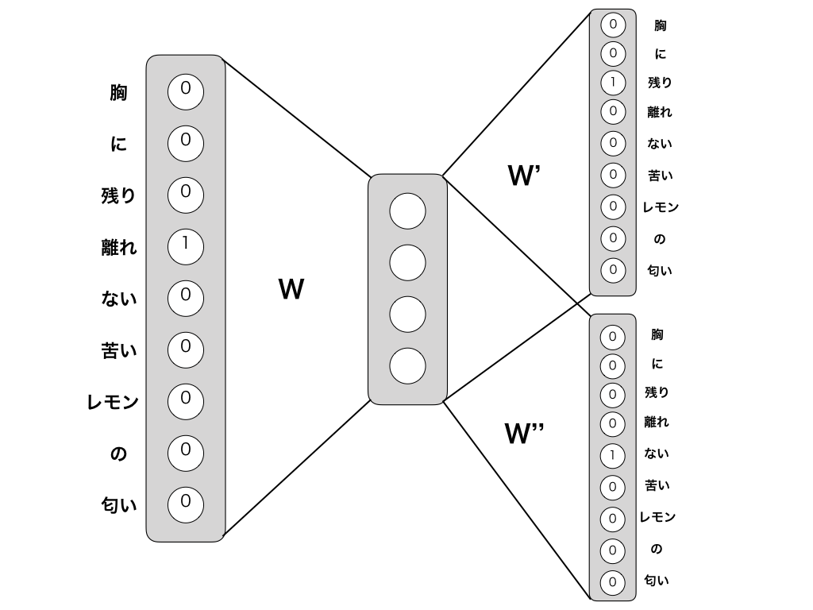
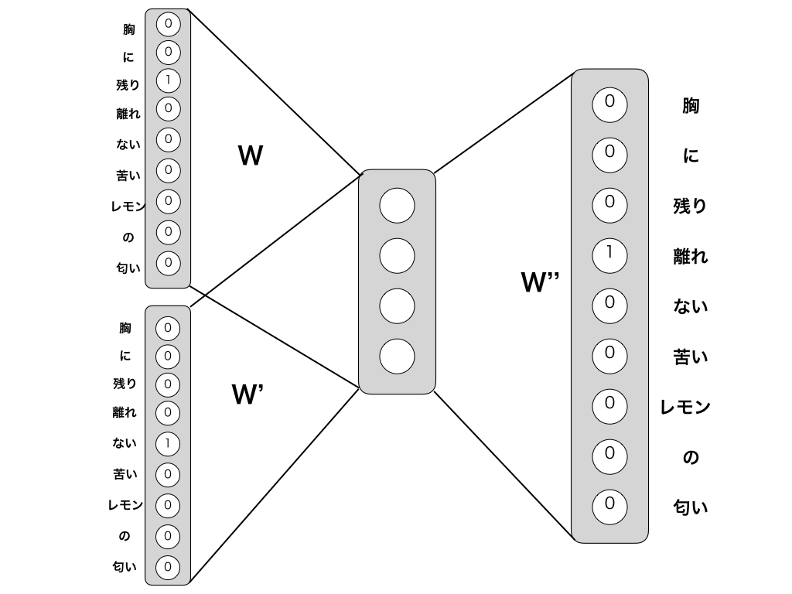

# word2vec
## word2vecとは
自然言語処理における単語の意味をベクトル化するためのニューラルネットワークである。テキストデータを解析し、単語の意味をベクトル化することで単語同士の類似性を計算したり、単語の意味の加算・減算が可能となる。  
word2vecには2つのモデルがる。
- Skip-gram  
    中心となる単語から周囲の単語を推測する
- CBOW(Countinuous Bag-of-Words)  
    周囲の単語から中心となる単語を推測する  

どちらのモデルもこの推測の精度を高めるように学習していくことで単語のベクトルが得られる。
## word2vecの仕組み
胸 / に / 残り / 離れ / ない / 苦い / レモン / の / 匂い
このような文章を入力した場合
### Skip-gramモデル
Skip-gramモデルでは

### CBOWモデル

